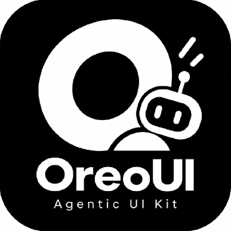

# OreoUI Starter Kits

Agentic UI kits for AI interfaces: Figma-parity primitives, agent surfaces, and the full
state vocabulary that conventional UI kits leave out.

[](https://github.com/oreoui)

## Kits

**Starter Kits** is the product line. Each kit ships the same token layer and the same
primitive contract, so a design can graduate between them without rework.

| Kit | Contents | Status |
| --- | --- | --- |
| **OreoUI Starter Kit: Foundations** | Colour, typography, elevation, radius, space and icon documentation as runnable code | Shipped |
| **OreoUI Starter Kit: Primitives** | Button, IconButton, Chip, Tag, Avatar, Loading, ShortcutKey, ImageGrid, Card, Dropdown, Timeline, FormInput | Shipped |
| **OreoUI Starter Kit: Agent** | Prompt composer, sidebar, top nav, pop-up, model select, chat container, thought chain, markdown + media rendering | Shipped |
| **OreoUI Starter Kit: Pro** | Remaining agent states across the full Figma set | In progress |

## What is in this repo

```
src/
  app/                     routes and the token layer (globals.css)
  components/ui/           primitives, one folder, one contract
  components/agent/        composites built on the primitives
  lib/                     shared helpers
```

- **Figma is the contract.** Component doc comments cite the Figma node they mirror, so
  parity is checkable rather than a matter of opinion.
- **Primitives compose.** Composites never re-implement a button, a spinner, or a control.
- **Tokens, not literals.** Colour, elevation and interaction fills resolve through
  `--oreo-*` custom properties; one class string works in both themes.
- **Full states or it does not ship.** default, hover, press, focus-visible, disabled,
  loading, error, empty.

## Getting started

```bash
bun install
bun run dev          # app on http://localhost:3000
bun run storybook    # component docs on http://localhost:6006
bun run build        # production build
bun run lint
```

## Docs

Storybook is the component documentation: `Primitives/*`, `Agent components/*`,
`Foundations/*`. `DESIGN.md` and `PRODUCT.md` hold the design laws and product intent that
the code is held to.
